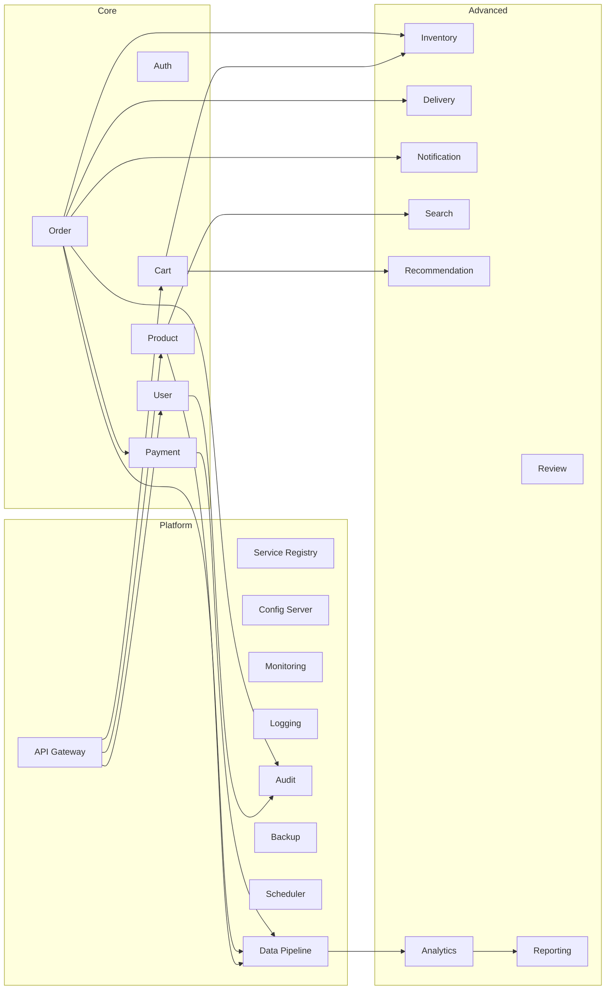
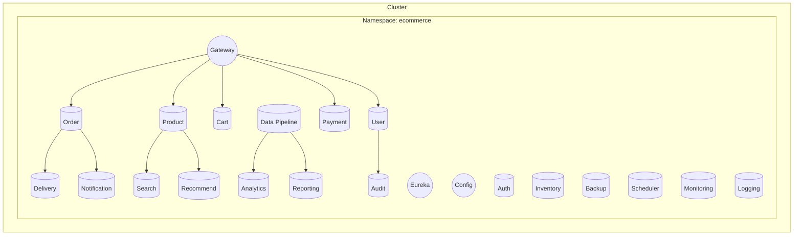
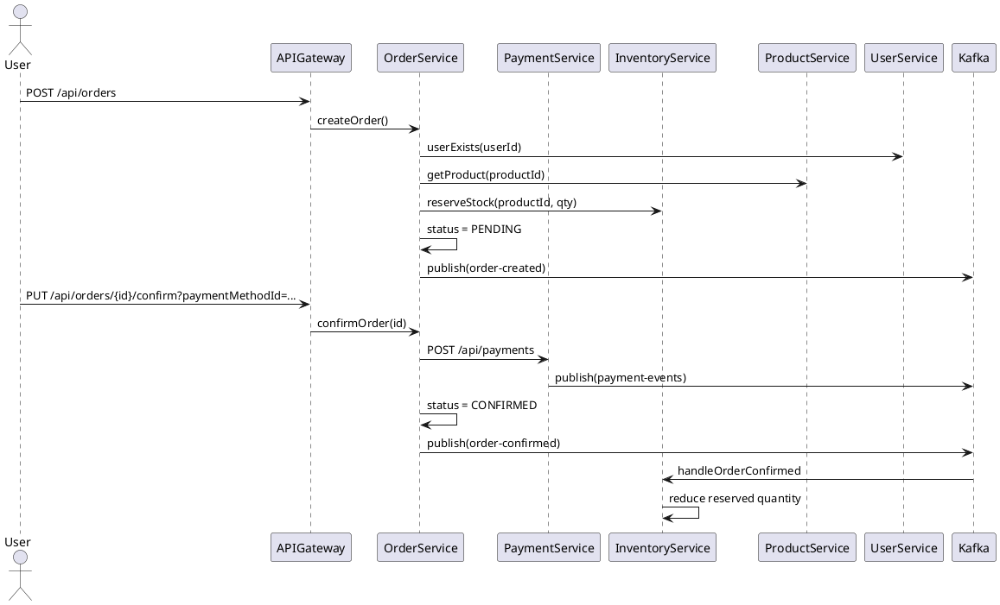

# E‑Commerce Microservices: Architecture, Relationships, and Data Flow

This document explains the full system architecture, microservice relationships, synchronous and event-driven flows, and how to operate the system. It includes example payloads and step-by-step flows across services, with citations to source files in this repository.

---

## 1) Architecture Overview

- **Pattern**: Microservices + API Gateway + Service Registry + Config Server
- **Sync calls**: Spring Cloud OpenFeign for REST between services
- **Async events**: Kafka for domain events (order, payment, cart, etc.)
- **Data stores**: Each service owns its data. Shared infra via Docker (Postgres, MongoDB, Kafka, Redis, etc.)
- **Observability**: Centralized logging and monitoring (ELK/Prometheus/Grafana) via infra compose

Key infra files:
- `docker-compose-infra.yml`
- `k8s/*.yml`
- `start-infrastructure.ps1`
- `run-e2e-tests.ps1`

Shared module:
- `common/` — shared DTOs and events (e.g., `com.ironsoftware.common.events.order.*`)

---

## Interactive Service Map

<div align="center">
 
<svg width="980" height="420" viewBox="0 0 980 420" xmlns="http://www.w3.org/2000/svg" role="img" aria-label="Service Map">
  <style>
    .node{fill:#FFFFFF;stroke:#1976D2;stroke-width:1.5;rx:8;ry:8}
    .core{stroke:#2E7D32}
    .adv{stroke:#6A1B9A}
    .plat{stroke:#455A64}
    .lbl{font: 12px Segoe UI, Arial; fill:#263238}
    .title{font: 14px Segoe UI, Arial; font-weight:700}
    .arrow{stroke:#78909C;stroke-width:1.2;marker-end:url(#arrowhead)}
    a:hover text{ text-decoration: underline; }
    a{ cursor: pointer; }
    @media (prefers-color-scheme: dark){
      .node{fill:#0f172a}
      .lbl{fill:#e2e8f0}
      .title{fill:#ffffff}
      .arrow{stroke:#94a3b8}
    }
  </style>
  <defs>
    <marker id="arrowhead" markerWidth="10" markerHeight="7" refX="10" refY="3.5" orient="auto">
      <polygon points="0 0, 10 3.5, 0 7" fill="#78909C"/>
    </marker>
  </defs>
  
  <!-- Platform -->
  <a href="../service-registry/README.md">
    <rect class="node plat" x="180" y="20" width="140" height="34"/>
    <text class="lbl" x="250" y="42" text-anchor="middle">Service Registry</text>
  </a>
  <a href="../api-gateway/README.md">
    <rect class="node plat" x="360" y="20" width="140" height="34"/>
    <text class="title" x="430" y="42" text-anchor="middle">API Gateway</text>
  </a>
  <a href="../config-server/README.md">
    <rect class="node plat" x="540" y="20" width="140" height="34"/>
    <text class="lbl" x="610" y="42" text-anchor="middle">Config Server</text>
  </a>
  
  <!-- Platform (Infra) -->
  <a href="../monitoring-service/README.md">
    <rect class="node plat" x="140" y="70" width="140" height="34"/>
    <text class="lbl" x="210" y="92" text-anchor="middle">Monitoring</text>
  </a>
  <a href="../logging-service/README.md">
    <rect class="node plat" x="320" y="70" width="140" height="34"/>
    <text class="lbl" x="390" y="92" text-anchor="middle">Logging</text>
  </a>
  <a href="../audit-service/README.md">
    <rect class="node plat" x="680" y="70" width="140" height="34"/>
    <text class="lbl" x="750" y="92" text-anchor="middle">Audit</text>
  </a>
  <a href="../backup-service/README.md">
    <rect class="node plat" x="860" y="70" width="100" height="34"/>
    <text class="lbl" x="910" y="92" text-anchor="middle">Backup</text>
  </a>
 
  <!-- Core row -->
  <a href="http://localhost:8080/api/users/">
    <title>User Service — /api/users</title>
    <rect class="node core" x="60" y="130" width="140" height="34"/>
    <text class="lbl" x="130" y="152" text-anchor="middle">User</text>
  </a>
  <a href="http://localhost:8080/api/auth/">
    <title>Auth Service — /api/auth</title>
    <rect class="node core" x="240" y="130" width="140" height="34"/>
    <text class="lbl" x="310" y="152" text-anchor="middle">Auth</text>
  </a>
  <a href="http://localhost:8080/api/products/">
    <title>Product Service — /api/products</title>
    <rect class="node core" x="420" y="130" width="140" height="34"/>
    <text class="lbl" x="490" y="152" text-anchor="middle">Product</text>
  </a>
  <a href="http://localhost:8080/api/cart/">
    <title>Cart Service — /api/cart</title>
    <rect class="node core" x="600" y="130" width="140" height="34"/>
    <text class="lbl" x="670" y="152" text-anchor="middle">Cart</text>
  </a>
  <a href="http://localhost:8080/api/orders/">
    <title>Order Service — /api/orders</title>
    <rect class="node core" x="780" y="130" width="140" height="34"/>
    <text class="lbl" x="850" y="152" text-anchor="middle">Order</text>
  </a>
  <a href="http://localhost:8080/api/payments/">
    <title>Payment Service — /api/payments</title>
    <rect class="node core" x="60" y="180" width="140" height="34"/>
    <text class="lbl" x="130" y="202" text-anchor="middle">Payment</text>
  </a>
 
  <!-- Advanced rows -->
  <a href="http://localhost:8080/api/inventory/">
    <title>Inventory Service — /api/inventory</title>
    <rect class="node adv" x="240" y="230" width="140" height="34"/>
    <text class="lbl" x="310" y="252" text-anchor="middle">Inventory</text>
  </a>
  <a href="http://localhost:8080/api/delivery/">
    <title>Delivery Service — /api/delivery</title>
    <rect class="node adv" x="420" y="230" width="140" height="34"/>
    <text class="lbl" x="490" y="252" text-anchor="middle">Delivery</text>
  </a>
  <a href="http://localhost:8080/api/notifications/">
    <title>Notification Service — /api/notifications</title>
    <rect class="node adv" x="600" y="230" width="140" height="34"/>
    <text class="lbl" x="670" y="252" text-anchor="middle">Notification</text>
  </a>
  <a href="http://localhost:8080/api/search/">
    <title>Search Service — /api/search</title>
    <rect class="node adv" x="780" y="230" width="140" height="34"/>
    <text class="lbl" x="850" y="252" text-anchor="middle">Search</text>
  </a>
  
  <a href="http://localhost:8080/api/reviews/">
    <title>Review Service — /api/reviews</title>
    <rect class="node adv" x="60" y="280" width="140" height="34"/>
    <text class="lbl" x="130" y="302" text-anchor="middle">Review</text>
  </a>
  <a href="http://localhost:8080/api/recommendations/">
    <title>Recommendation Service — /api/recommendations</title>
    <rect class="node adv" x="240" y="280" width="180" height="34"/>
    <text class="lbl" x="330" y="302" text-anchor="middle">Recommendation</text>
  </a>
  <a href="http://localhost:8080/api/analytics/">
    <title>Analytics Service — /api/analytics</title>
    <rect class="node adv" x="440" y="280" width="140" height="34"/>
    <text class="lbl" x="510" y="302" text-anchor="middle">Analytics</text>
  </a>
  <a href="http://localhost:8080/api/reports/">
    <title>Reporting Service — /api/reports</title>
    <rect class="node adv" x="620" y="280" width="140" height="34"/>
    <text class="lbl" x="690" y="302" text-anchor="middle">Reporting</text>
  </a>
  
  <!-- Infra extras -->
  <a href="../audit-service/README.md">
    <rect class="node plat" x="60" y="330" width="140" height="34"/>
    <text class="lbl" x="130" y="352" text-anchor="middle">Audit</text>
  </a>
  <a href="../scheduler-service/README.md">
    <title>Scheduler Service — batch jobs, cron tasks</title>
    <rect class="node plat" x="240" y="330" width="140" height="34"/>
    <text class="lbl" x="310" y="352" text-anchor="middle">Scheduler</text>
  </a>
  <a href="http://localhost:8080/api/pipeline/">
    <title>Data Pipeline Service — /api/pipeline</title>
    <rect class="node plat" x="420" y="330" width="180" height="34"/>
    <text class="lbl" x="510" y="352" text-anchor="middle">Data Pipeline</text>
  </a>
  <a href="../logging-service/README.md">
    <title>Logging Service — centralized logs</title>
    <rect class="node plat" x="620" y="330" width="140" height="34"/>
    <text class="lbl" x="690" y="352" text-anchor="middle">Logging</text>
  </a>
  <a href="../monitoring-service/README.md">
    <title>Monitoring Service — metrics and health</title>
    <rect class="node plat" x="800" y="330" width="140" height="34"/>
    <text class="lbl" x="870" y="352" text-anchor="middle">Monitoring</text>
  </a>
 
  <!-- Lines from Gateway to core services (illustrative) -->
  <line class="arrow" x1="430" y1="54" x2="130" y2="130"/>
  <line class="arrow" x1="430" y1="54" x2="310" y2="130"/>
  <line class="arrow" x1="430" y1="54" x2="490" y2="130"/>
  <line class="arrow" x1="430" y1="54" x2="670" y2="130"/>
  <line class="arrow" x1="430" y1="54" x2="850" y2="130"/>
 
  <!-- Inter-service arrows (illustrative) -->
  <line class="arrow" x1="670" y1="164" x2="310" y2="230"/> <!-- Cart -> Inventory -->
  <line class="arrow" x1="850" y1="164" x2="490" y2="230"/> <!-- Order -> Delivery -->
  <line class="arrow" x1="850" y1="164" x2="670" y2="230"/> <!-- Order -> Notification -->
  <line class="arrow" x1="490" y1="164" x2="850" y2="230"/> <!-- Product -> Search -->
</svg>
 
</div>

<p align="center"><em>Static export:</em> <a href="images/service-map-architecture.svg">docs/images/service-map-architecture.svg</a></p>

#### How to use the interactive diagrams

- **Click any service node** to open its live API via the Gateway (e.g., `http://localhost:8080/api/<service>/`).
- **Tooltips** show the service name and route; **hover states** underline labels.
- **Dark mode** honors your system preference via `prefers-color-scheme`.
- **Infra nodes** link to their local READMEs for details.
- Ensure the stack is running so the Gateway is reachable at `http://localhost:8080`.

#### Quick links (Swagger & OpenAPI)

- User: [Swagger UI](http://localhost:8080/api/users/swagger-ui/index.html) · [OpenAPI JSON](http://localhost:8080/api/users/v3/api-docs)
- Product: [Swagger UI](http://localhost:8080/api/products/swagger-ui/index.html) · [OpenAPI JSON](http://localhost:8080/api/products/v3/api-docs)
- Cart: [Swagger UI](http://localhost:8080/api/cart/swagger-ui/index.html) · [OpenAPI JSON](http://localhost:8080/api/cart/v3/api-docs)
- Order: [Swagger UI](http://localhost:8080/api/orders/swagger-ui/index.html) · [OpenAPI JSON](http://localhost:8080/api/orders/v3/api-docs)
- Payment: [Swagger UI](http://localhost:8080/api/payments/swagger-ui/index.html) · [OpenAPI JSON](http://localhost:8080/api/payments/v3/api-docs)
- Inventory: [Swagger UI](http://localhost:8080/api/inventory/swagger-ui/index.html) · [OpenAPI JSON](http://localhost:8080/api/inventory/v3/api-docs)
- Delivery: [Swagger UI](http://localhost:8080/api/delivery/swagger-ui/index.html) · [OpenAPI JSON](http://localhost:8080/api/delivery/v3/api-docs)
- Notification: [Swagger UI](http://localhost:8080/api/notifications/swagger-ui/index.html) · [OpenAPI JSON](http://localhost:8080/api/notifications/v3/api-docs)
- Review: [Swagger UI](http://localhost:8080/api/reviews/swagger-ui/index.html) · [OpenAPI JSON](http://localhost:8080/api/reviews/v3/api-docs)
- Search: [Swagger UI](http://localhost:8080/api/search/swagger-ui/index.html) · [OpenAPI JSON](http://localhost:8080/api/search/v3/api-docs)
- Recommendation: [Swagger UI](http://localhost:8080/api/recommendations/swagger-ui/index.html) · [OpenAPI JSON](http://localhost:8080/api/recommendations/v3/api-docs)
- Analytics: [Swagger UI](http://localhost:8080/api/analytics/swagger-ui/index.html) · [OpenAPI JSON](http://localhost:8080/api/analytics/v3/api-docs)
- Reporting: [Swagger UI](http://localhost:8080/api/reports/swagger-ui/index.html) · [OpenAPI JSON](http://localhost:8080/api/reports/v3/api-docs)
- Data Pipeline: [Swagger UI](http://localhost:8080/api/pipeline/swagger-ui/index.html) · [OpenAPI JSON](http://localhost:8080/api/pipeline/v3/api-docs)

<sub>If a link returns 404, the service may not expose Swagger UI; use the base route or service README.</sub>

### 🧩 Component Architecture



### 🌐 Deployment Topology



---

## 2) Service Catalog and Responsibilities

- **API Gateway** (`api-gateway/`): Routes external HTTP traffic.
- **Service Registry** (`service-registry/`): Discovery (Eureka).
- **Config Server** (`config-server/`): Centralized Spring configuration.

Domain services:
- **Auth Service** (`auth-service/`): AuthN/Z, JWT issuance/validation.
- **User Service** (`user-service/`): User profiles, user existence checks.
- **Product Service** (`product-service/`): Product catalog, product existence/details.
- **Inventory Service** (`inventory-service/`): Stock levels, reservations, confirmations, releases.
  - Source: `inventory-service/src/main/java/.../service/InventoryService.java`
- **Cart Service** (`cart-service/`): User carts; validates products & inventory before adding.
- **Order Service** (`order-service/`): Order lifecycle (PENDING → CONFIRMED → CANCELLED/COMPLETED).
  - Source: `order-service/src/main/java/.../service/OrderService.java`
- **Payment Service** (`payment-service/`): Payment processing and events.
  - Source: `payment-service/src/main/java/.../controller/PaymentController.java`
  - Source: `payment-service/src/main/java/.../service/PaymentService.java`
- **Delivery Service** (`delivery-service/`): Shipment lifecycle.
- **Notification Service** (`notification-service/`): WebSocket/Channel notifications.
- **Review Service** (`review-service/`): Product reviews.
- **Recommendation Service** (`recommendation-service/`): Suggestion engine.
- **Search Service** (`search-service/`): Search index/query.
- **Analytics Service** (`analytics-service/`): Analytics pipelines.
- **Reporting Service** (`reporting-service/`): Business reports.
- **Audit Service** (`audit-service/`): Auditable events.
- **Backup Service** (`backup-service/`): Data backup jobs.
- **Scheduler Service** (`scheduler-service/`): Periodic jobs.
- **Data Pipeline Service** (`data-pipeline-service/`): Stream processing.
- **Logging Service** (`logging-service/`), **Monitoring Service** (`monitoring-service/`): Ops.

---

## 3) Startup Order

1. Infrastructure: `start-infrastructure.ps1` (or `docker-compose-infra.yml`)
2. Platform services: `service-registry/` → `config-server/` → `api-gateway/`
3. Core domain: `auth-service/`, `user-service/`, `product-service/`, `inventory-service/`, `cart-service/`, `order-service/`, `payment-service/`
4. Support: notification, delivery, review, recommendation, search, analytics, reporting, etc.

Verification:
- Eureka shows registered services.
- Health endpoints return UP.
- Kafka topics exist (auto-created by producers if configured).

---

## 4) High-Level Data Flows

### A. Place Order (Happy Path)

1) Client adds items to cart
- `cart-service` validates with:
  - `product-service` (product exists)
  - `inventory-service` (availability)
- Source: `cart-service/src/main/java/.../service/CartService.java`
- Kafka (optional): cart events → `cart-events`

2) Client creates order
- Client → `api-gateway` → `order-service`
- `order-service`:
  - validates user via `user-service`
  - fetches product details via `product-service`
  - reserves stock via `inventory-service` (per item)
  - sets status `PENDING`
  - publishes `order-created`
- Source: `order-service/.../service/OrderService.java::createOrder(...)`

3) Client confirms order (with payment)
- `PUT /api/orders/{orderId}/confirm?paymentMethodId=...`
- `order-service` → `payment-service` (`POST /api/payments`)
- If payment `COMPLETED`:
  - set status `CONFIRMED`
  - publish `order-confirmed`
- Source: `order-service/.../service/OrderService.java::confirmOrder(...)`
- Feign: `order-service/.../client/PaymentServiceClient.java`
- Payment API: `payment-service/.../controller/PaymentController.java`

4) Inventory adjusts on confirmation
- `inventory-service` listens `order-confirmed`
- convert reserved → fulfilled (reduce reserved)
- Source: `inventory-service/.../service/InventoryService.java::handleOrderConfirmed(...)`

5) Delivery & Notification (optional)
- Delivery consumes `order-confirmed` → create shipment
- Notification consumes events → notify user

6) Payment events
- `payment-service` publishes `payment-events` with status and transactionId
- Consumers: Analytics/Audit/Notification
- Source: `payment-service/.../service/PaymentService.java`

### B. Cancel Order

- `PUT /api/orders/{orderId}/cancel`
- `order-service` sets `CANCELLED` and publishes `order-cancelled`
- `inventory-service` consumes `order-cancelled` and releases reserved stock
- Source: `order-service/.../service/OrderService.java::cancelOrder(...)`
- Source: `inventory-service/.../service/InventoryService.java::handleOrderCancelled(...)`

---

## 5) Synchronous Relationships (Feign)

- **Order → User**: validate user
  - `GET /api/users/{id}/exists`
- **Order/Cart → Product**: product existence/details
  - `GET /api/products/{id}`, `GET /api/products/{id}/exists`
- **Order/Cart → Inventory**: availability, reserve, release
  - `POST /api/inventory/reserve`, `POST /api/inventory/release`, `GET /api/inventory/check`
- **Order → Payment**: process payment
  - `POST /api/payments` (aligned)

Source references:
- `order-service/.../client/*.java`
- `cart-service/.../client/*.java`

---

## 6) Event Topics and Producers/Consumers

- **order-created**
  - Producer: `order-service`
  - Consumers: analytics/audit/notification (optional)

- **order-confirmed**
  - Producer: `order-service`
  - Consumer: `inventory-service`

- **order-cancelled**
  - Producer: `order-service`
  - Consumer: `inventory-service`

- **payment-events**
  - Producer: `payment-service`
  - Consumers: analytics/audit/notification

- **cart-events** (if enabled)
  - Producer: `cart-service`

---

## 7) Example API Calls and Payloads

Create Order
```http
POST /api/orders
Content-Type: application/json

{
  "userId": "user-123",
  "shippingAddress": "123 Main St",
  "paymentMethodId": "pm_abc",
  "items": [
    { "productId": "prod-1", "variantId": "var-1", "quantity": 2 }
  ]
}
```

Confirm Order (with payment)
```http
PUT /api/orders/{orderId}/confirm?paymentMethodId=pm_abc
```

Cancel Order
```http
PUT /api/orders/{orderId}/cancel
```

Payment (internal from Order Service)
```http
POST /api/payments
Content-Type: application/json

{
  "orderId": "<orderId>",
  "userId": "user-123",
  "amount": 149.99,
  "paymentMethod": "CREDIT_CARD",
  "paymentMethodId": "pm_abc"
}
```

---

## 8) Important Code References

- Order confirmation with payment
  - `order-service/src/main/java/com/ironsoftware/orderservice/service/OrderService.java::confirmOrder(...)`
  - `order-service/src/main/java/com/ironsoftware/orderservice/client/PaymentServiceClient.java`

- Inventory event handlers
  - `inventory-service/src/main/java/com/ironsoftware/inventoryservice/service/InventoryService.java::handleOrderConfirmed(...)`
  - `inventory-service/src/main/java/com/ironsoftware/inventoryservice/service/InventoryService.java::handleOrderCancelled(...)`

- Payment controller/events
  - `payment-service/src/main/java/com/ironsoftware/paymentservice/controller/PaymentController.java`
  - `payment-service/src/main/java/com/ironsoftware/paymentservice/service/PaymentService.java`

- Cart validation
  - `cart-service/src/main/java/com/ironsoftware/cartservice/service/CartService.java`

---

## 9) PlantUML Sequence (Order Happy Path)



---

## 10) Operations & Best Practices

- **Idempotency**: Consumers should be idempotent; repeat events must not corrupt state.
- **Resilience**: Use circuit breakers/retries (e.g., `cart-service` with Resilience4j).
- **Transactions & Events**: Consider Outbox/Saga for stronger guarantees.
- **Security**: JWT via `auth-service`; enforce at Gateway and services as needed.
- **Config**: Externalize via Config Server.

---

## 11) How to Export this Document to PDF

Option A) VS Code Print to PDF
- Open this Markdown file.
- Open Preview (Ctrl+Shift+V), then use browser print to PDF (right-click → Print… → Save as PDF).

Option B) VS Code Extension: "Markdown PDF"
- Install extension "Markdown PDF".
- Right-click this file → "Markdown PDF: Export (pdf)".

Option C) Pandoc (if installed)
```powershell
pandoc -s "docs/Ecommerce-System-Architecture.md" -o "docs/Ecommerce-System-Architecture.pdf"
```

---

## 12) Summary

- The system uses synchronous validations (Feign) before state changes and asynchronous events (Kafka) to decouple lifecycle transitions.
- Inventory is reserved at order creation and adjusted at confirmation/cancellation via events.
- Payment must succeed before order confirmation and inventory finalization.
- All 26 services compile and integrate into coherent flows ready for deployment.
